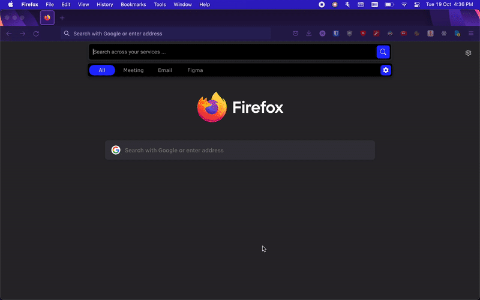
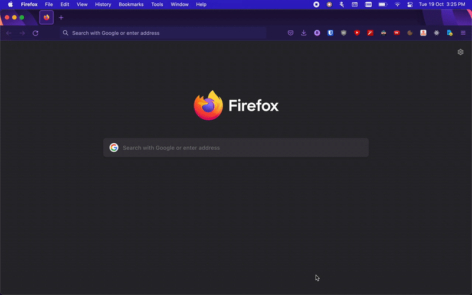
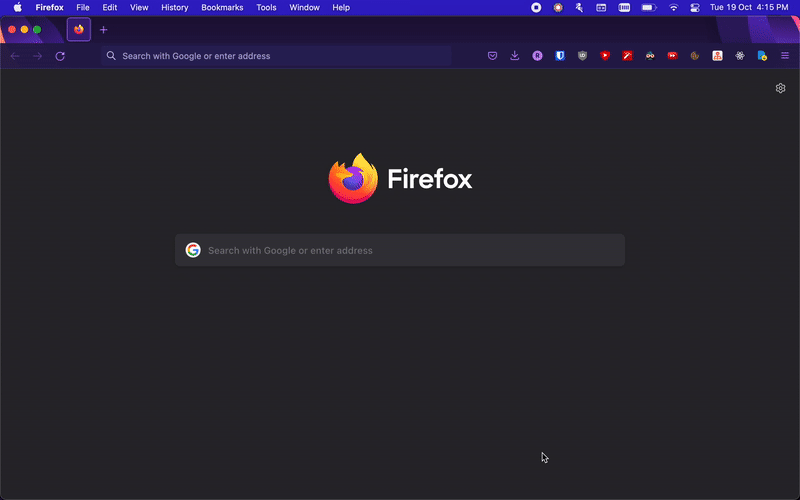
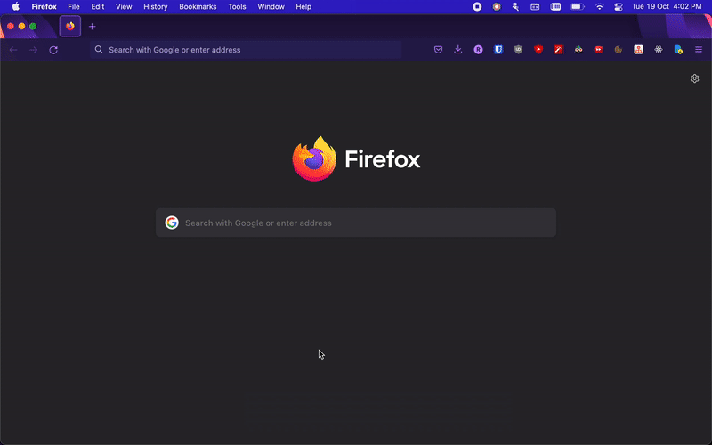
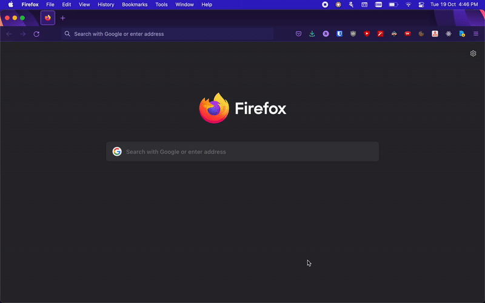
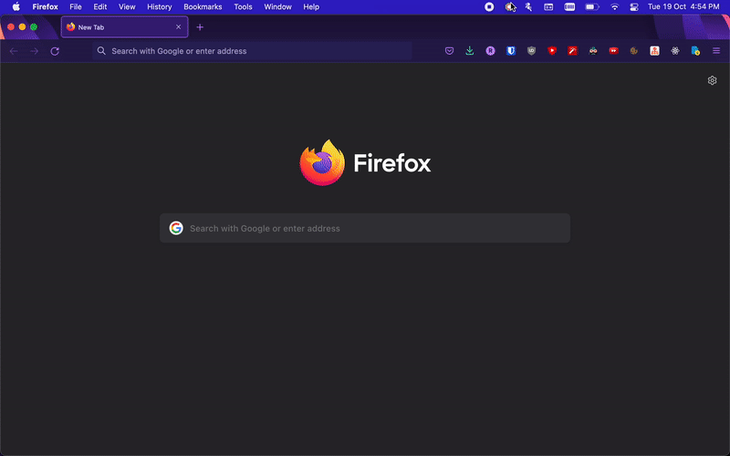

# Memopine

Memopine was a spotlight-like search interface that provided search results from authenticated services like google suite, zoom. A search-engine that furnishes results from _your_ knowledge silos across third party services.

This repository is just a public mirror with **some** code from the `Electron App` and does not contain all the parts required to run this demo. If you are looking for soemthing that achieves what _Memopine_ wished to achieve have a look at [Raycast](raycast.com/).

# Demos

    
1. Connecting Third Party Services

    

     
Upon successful authentication, all access information is stored locally with a sqlite instance, i.e. no credentials are stored by the auth provider. Access Tokens are refreshed automagically in the background.

     
All requests for indexing/searching data make use of credentials stored locally, making for secure access to services.
     

    

    
    

 

    
1. Opening a Figma Node

    

    
    

 

    
2. Opening a meeting in Zoom

    

    <h1>Connecting supported third party services is as simple as</h1>
    
    

 

    
3. Directly lookup your mail/calendar

    

    Background process keep track of your upcoming meetings, notify with quicklink to join them.
    

    Mail:
    
    Calendar:
    
    

 

    
5. Get notified for your meetings

    

    Background process keep track of your upcoming meetings, notify with quicklink to join them.
    

    
    

